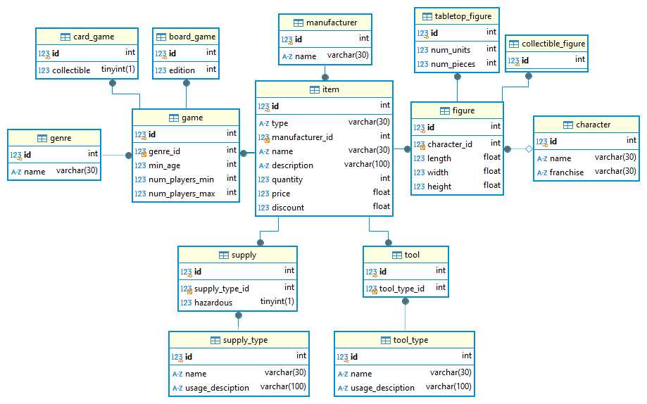

# Lagringssystem - Specialisterne gruppe 3

Et projekt der indeholder en implenentation af et lille lagringssystem med en HTTP API server. Ved kørsel af serveren oprettes databasetabellerne og et sæt prædefinerede tabelindgange.

## Kørsel

Udfyld først dine forbindelsesoplysninger til din MySQL server i `dbinfo.py` og opret en ny database med samme navn som variablen `DATABASE`. Brug `git update-index --assume-unchanged dbinfo.py` for at få git til at ignorere dine ændringer til filen.

Lav derefter et nyt Python virtual environment og installer pakkerne listet i `requirements.txt`.

HTTP API serveren startes ved at køre `python backend.py`.

For at køre tests skal HTTP API serveren først startes i "test mode" ved at køre `python backend.py testmode`, hvorefter API'en og databasehandlinger kan blive aftestet ved at køre `pytest tests.py`. For mere uddybende testinformation kan testkoden også køres direkte med `python tests.py`.

Der er et demoscript som kan køres med `python demo.py`. Her kan man bruge terminalen til at udføre en række operationer og vise resultatet.

## HTTP API

HTTP API'en retunerer en statuskode på `200`, hvis andmodningen var succesfuld, ellers retuneres en streng med fejlen og en status kode på `400`.

- GET `/api/items/<string:table_name>`
  - Henter tabelindgange fra specificeret tabel med muligt filter.
    - `<table_name>`: Navn på tabel.
    - `[BODY]`: JSON objekt med `kolonne: værdi` søgepar indgange.
    - `RESPONSE`: JSON liste af tabelindgange.
- GET `/api/item/<string:table_name>/<int:id>`
  - Henter en specifik tabelindgang fra en tabel.
    - `<table_name>`: Navn på tabel.
    - `<id>`: Tabelindgangens ID.
    - `RESPONSE`: JSON objekt af tabelindgang.
- POST `/api/item`
  - Laver en ny ting med et JSON objekt.
    - `<BODY>`: JSON objekt med de nødvendige de nødvendige `kolonne: værdi` par. Typen af tingen specificeres med `item_type: type navn` indgangen. Foreign nøgle kolonner kan også specificeres ved at fjerne det endelige `_id` i kolonnenavnet. I dette tilfælde kan der gives navnet på den refererede tabelindgang i stedet for dets ID hvis ønsket.
    - `RESPONSE`: Den nye tabelindgang som et JSON objekt.
- PUT `/api/item/<string:table_name>/<int:id>`
  - Opdaterer en tabelindgang med et JSON objekt med kolonneværdier der skal ændres.
    - `<table_name>`: Navn på tabel.
    - `<id>`: Tabelindgangens ID.
    - `<BODY>`: JSON objekt med ændringer.
    - `RESPONSE`: ID'et på tabelindgangen.
- PUT `/api/items/<string:table_name>`
  - Opdaterer flere tabelindgange på en gang med muligt filter.
    - `<table_name>`: Navn på tabel.
    - `<BODY>`: JSON objekt med en `blueprint` indgang med et objekt med ændringer, og muligvis en `filter` indgang med et objekt af `kolonne: værdi` søgepar indgange.
    - `RESPONSE`: Antallet af opdaterede tabelindgange som JSON objekt.
- DELETE `/api/item/<string:table_name>/<int:id>`
  - Sletter en tabelindgang.
    - `<table_name>`: Navn på tabel.
    - `<id>`: Tabelindgangens ID.
    - `RESPONSE`: Strengen `deleted`.

## Database struktur

## Filer

- `dbinfo.py`: Database forbindelsesoplysninger.
- `dbcontext.py`: Håndtering af singeton database forbindelse.
- `models.py`: Definitioner af database kasser/tabeller.
- `factory.py`: Factory til kreation af nye tabelindgange.
- `db_seed.py`: Indholder prædefinerede tabelindgange til databasen.
- `backend.py`: Database HTTP API.
- `tests.py`: Testing af database og API.
